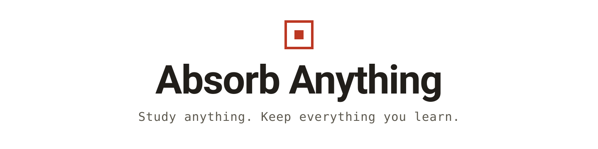
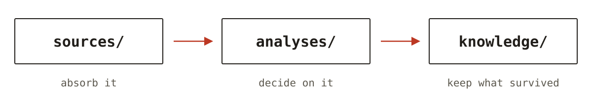

<div align="center">

<picture>
  <source media="(prefers-color-scheme: dark)" srcset="docs/assets/banner-dark.svg">
  
</picture>

**Study anything. Keep everything you learn.**

[](https://github.com/NB-Corp/absorb-anything/actions/workflows/ci.yml)
[](LICENSE)
[](https://nodejs.org)

[Website](https://nb-corp.github.io/absorb-anything/) · [Install](#install) · [The loop](#the-loop) · [own-work (build half)](https://github.com/NB-Corp/own-work)

English · [简体中文](./README.zh.md)

</div>

---

Absorb Anything is a local-first CLI for people (and AI agents) who are always absorbing something new — a codebase to evaluate, a library to build on, a reference implementation, a paper and its companion repo. Point it at whatever you're studying and that material gets a **home**: a place where checkouts, observations, analyses, and distilled knowledge accumulate, instead of evaporating when the terminal closes and the next chat session starts from zero.

```bash
absorb init                                      # one .absorb/ folder, right in your repo
absorb add https://github.com/qiskit/qiskit      # a repo URL or any folder — give it a home
absorb log qiskit                                # how it changed since you last looked
absorb analysis new "Adopt the scheduler?" --for-source qiskit
absorb knowledge add pattern "Pulse schedules are immutable plans"
```

> Status: 0.1.0, pre-release, not on npm yet. Build from source with the steps below. The commands above are the committed surface for the first release, not a mockup.

## Install

Requires Node >= 22.13 and pnpm 11.

```bash
git clone https://github.com/NB-Corp/absorb-anything
cd absorb-anything
pnpm install && pnpm build
```

The CLI is now at `packages/absorb-anything/dist/cli.js`. Put it on your PATH however you like — an alias is enough:

```bash
alias absorb="node $PWD/packages/absorb-anything/dist/cli.js"
```

## The loop

Everything in Absorb Anything serves one loop:

<p align="center">
  <picture>
    <source media="(prefers-color-scheme: dark)" srcset="docs/assets/loop-dark.svg">
    
  </picture>
</p>

A **source** is any external material kept where its origin and its changes stay readable — a git checkout that syncs, or a one-time copy of anything else. An **analysis** is the working surface where you read it and reach a decision. **Knowledge** is what survived the decision and is worth reusing. Files all the way down: no server, no database, no account. Everything sits in a single `.absorb/` directory inside the repo you already work in; if evidence deserves a dedicated repo of its own, that's `absorb init --standalone`.

Absorbing a source records where it came from and what state you saw it in:

```console
$ absorb add https://github.com/sindresorhus/slugify
Added source: .absorb/sources/slugify
Observation: .absorb/sources/slugify/observations/20260828-7c318bd1aa4b.yaml
Checkout: .absorb/sources/slugify/checkout
Materials: .absorb/sources/slugify/materials
Hint: Observe changes with `absorb sync`; preserve decision-critical bytes with `absorb capture`.

$ absorb log slugify
Source log: slugify
2026-08-28T19:59:18+08:00 add normal 20260828-7c318bd1aa4b
  checkout-backed source added from https://github.com/sindresorhus/slugify
```

## Clone once. Reference everywhere.

The problem with studying code across projects is not disk space — it's re-reading. The same library gets cloned into five projects and understood five times from scratch.

Here, one workspace owns a source's home. Every other workspace links to it with a few dozen bytes:

```bash
absorb link ../research qiskit        # sources/qiskit/source.ref.yaml, that's the whole file
absorb sync qiskit                    # works from anywhere; writes through to the real home
absorb home qiskit                    # shows where the home actually is
```

A machine-local registry remembers every home you've created, so `absorb add` on a URL you already studied says so before you clone it again, and a broken link tells you where the home went.

## Evidence when the decision needs it

Recording is priced by what your decision is worth, not by what the tool can measure:

- Reading around? An entry is an alias and a date. Nothing else.
- Adopting or rejecting? Pin the commit (free for git sources).
- Need the bytes to survive upstream deletion? `absorb capture` snapshots them with an integrity hash.

Syncing never refuses to work because your checkout is dirty. Local experiments on someone else's code are how reading actually happens; the ledger records them as what they are.

## Built for AI agents

Agents misuse tools whose semantics live only in documentation. This CLI explains itself at the point of use:

```bash
absorb prime            # one screen: what each object is for, and the current workspace state
absorb explain source   # why an object exists, when not to use it, common misuses
```

Mutating commands end with a one-line reminder of the rule most often broken, and error messages state the correct model instead of just refusing. Start a session with `absorb prime` and the agent gets the semantics before it gets the chance to misread them.

## Part of a pair

Absorb Anything is the study half of a two-tool suite. [`own-work`](https://github.com/NB-Corp/own-work) is the build half: tasks, roadmaps, specs, and the systems you're building, on the same on-disk workspace format. Use either alone, or run both over one `.absorb/` directory.

**Absorb anything. Build Your Own.**

## License

MIT.
